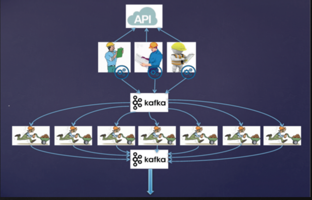
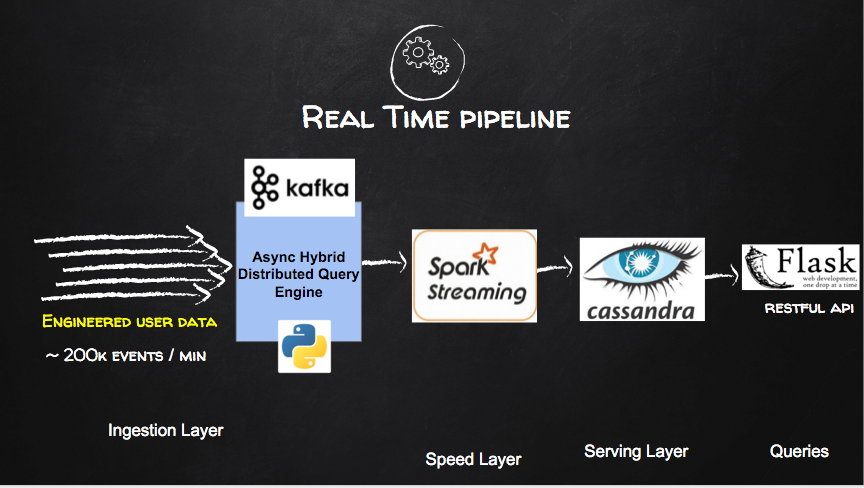
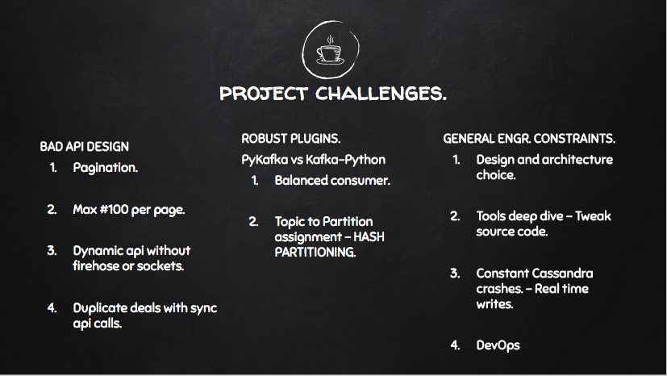
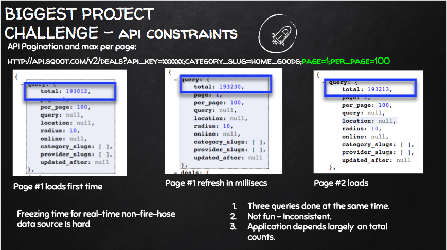

# Introduction to ExStreamly Cheap
============

*This is an actively developed product. Hence documentation is a work in progress*

Table of Contents:

1. [Introduction](README.md#1-introduction)
2. [Motivation](README.md#2-motivation)
3. [Sample Queries](README.md#3-sample-queries)
4. [Engineering Solution](README.md#4-engineering-solution) 
5. [Challenges](README.md#5-challenges)
6. [Take Away](README.md#6-take-aways)
7. [Demo and Slides](README.md#7-demo-and-slides)
8. [Youtube video](README.md#8-direct-youtube-video)
9. [Sample Query Results](README.md#9-sample-query-results)

## 1. Introduction
ExStreamly Cheap is a real time scalable deals serving platform. It provides Insights and searching capabilities, maximizing time and profit for end users. 
For three weeks, I worked on www.exstreamlycheap.club using open source tools to create a single platform for inspiration, search, shopping and serving of deals. I leveraged Sqoot's API to gather deals aggregated over different vendors, providers and categories.
A naive recommendation framework is also implemented making it very easy to plug in more robust collaborative filtering or item-item/item-user affinity implementations; to solve more business use cases.

## 2. Motivation
As a techy and gagdet lover, I noticed that I spent a lot of time scouting various sites for the best deals. We all know the importance of savings while getting amazing items at amazing bargains. Searching platforms like Amazon, Groupon and others is a trivial thing. And there are tons of coupons and deals providing sites. However, what makes a deal a deal? Are the prices a real representation of an actual discount when compared to the manufacturers MSRP or is there a third-party mockup? How can a certain deal be addressed and personalized? There isn't a platform that offered a complete, provider agnostic, user-defined preference inspired platform. ExStreamly cheap is my proposed solution to a one-everything platform to solve this problem. From inspiration, search, shopping to recommendations of details based on preferences. My end goal is to develop a notification system on the platform to alert users when deals that match their interest arrive in real time; location based interests, price, discount rate or other interest. This will require plugging in a specialized robust collaborative filtering, affinity inspired recommendation system.

## 3. Sample Queries
Data Source: SQOOT API. Please visit [developer page](http://docs.sqoot.com/v2/overview.html) for an overview of their API.
During the program, the following queries were successfully constructed and executed.
  1. A holistic view of real time trends and purchase visualizations.
  

  2. Deals search based on price and discount options.
  


  3. Display of recommendations based on engineered user interaction with respect to trends and sales.
  

  4. Users purchasing patterns and interactions: location-based and reviews.
  

  5. Merchant search based on categories

## 4. Engineering Solution
The pipeline comprises of both batch and realtime pieces. ExStreamly Cheap pipeline was designed with the Lambda Architecture in mind.

### Batch Process
At Ingestion, boostraping the data pipeline, an asynchronous distributed query engine, (Async DQE) calls the Sqoot API, computes the range of pages to fetch, take into account a time change between the first snapshot and actual data fetch. The fetched data is then marshalled into the pipeline for batch processing.

The Async Distributed Query Engine (ADQE) is a hybrid distributed querying engine, leveraging kafka's thread safeness and messaging queue, that was implemented to mitigate the pagination challenge of the Sqoot API. As ExStreamly Cheap is a service by category platform, a lot of dependency lies on the accuracy of the specified total number of deals at any given time. Sqoot's API was inconsistent, constantly changing total amounts with each millisecond page refresh.The Async DQE is split into three major components.
  1. [First Stage Producer](src/fetch_data/generate_all_categories.py) that utilizes [Sqoot Data Fetcher](src/fetch/fetch_sqoot_data.py) to interact with the API. Multiple producers - one for each category -  are spun in parallel on tmux sessions as the main interaction with the data source. As each category total is computed, the producers into the first kafka topic       
```all_deals_ url - a message with timestamp, url for consumer to fetch and page chunks to grab. ```

This follows the leaky bucket approach. 

  2. Intermediate Hybrid Consumer-Producer that creates multiple consumers (2:1 producer) to enable a unique fetch of actual data. A consumer-producer becomes available, fetches from the first stage topic. For that instance of producer, multiple OS threads are spun to grab each individual page as fast as possible. At this point, order of deals isn't important. Aggregation will be handled in spark. The final order synchronization when writing out to file (or another subsequent kafka topic) is handled by a BoundedSemaphore. Output is then written to the final ```deals_data``` topic.
  3. Final Stage Consumer that fetches from the final kafka topic and persists the data to HDFS.


### Realtime Process
The streaming process data source is a data from an engineered process flow. Sqoot API isn't implemented as a firehose. Hence depending on that a source would be micro-batches and not a real time flow.


### Spark processing (Applies to speed and batch layers)
After ingestion, the data is persisted in HDFS for the batch pipeline. From HDFS a batch process reads all data from the file system for a batch view pre-computation. For both streaming and batch, the deals data are then converted into Spark RDDs. Using Spark MapReduce, further filtering is done to remove duplicate and unneccessary features from the JSON objects. The RDDs are then converted in dataframes that are easily queriable using Spark SQL. In order to perform range and time series queries in cassandra, care is taken at this stage to construct the columns properly before a final load into cassandra.

Queries are served to the user via a web app that was hosted on http://exstreamlycheap.club or via intuitive RESTFUL APIs. The clusters are currently shut down after the project, but the video people shows details of this interactive interface.

## 5. Challenges
A lot challenges were meant a long the way. A few outstanding ones are completely outlined on the figure below.



## 6. Take Aways
The following are some of the lessons learned.
  1. There are ubiquitous engineering intricacies that go into designing a robust data pipeline. Careful consideration need to be given to release versions, bugs reported, features already supported by client libraries and documentation (most important in my opinion). A choice between your favorite programming language, which may not be the tool's native implementation, vs the native language implementation is very key. If a native language is chosen, then you may need to learn a new language like SCALA.
  
  2. The best/optimal design architecture for the Asynchronous Distributed Querying Engine (Async DQE) was a bit challenging. Tradeoffs had to made to ensure uniqueness of deals. Crawling the API synchronously led to duplicate and expired deals. 
  
This reason led to implementing Async DQE to try and fetch unique deals asynchronously in parallel, utilizing PyKafka asynchronous producers and balanced consumer implementations. This path was choosen because of the 
```LEAKY BUCKET ALGORITHM,  kafka's thread safeness, message queuing and ability to multithread a balanced consumer.``` 
  3. Taking deep dives to tweak these open source code tools, changing methods to solve use cases offered by Native APIs and not yet supported on the wrapper clients. For instance I had started to implement a HASH Partition on Kafka-Python for dynamic topic-to-consumer instance assignment; to avoid flooding a particular hybrid consumer-producer consuming a particular partition. With further research, I found an already existing implementaion on PyKafka.
  4. Proper Cassandra Indexing: Partitioning and clustering during schema design is very important. CQL isn't SQL.

  ``` CREATE TABLE trend_with_price PRIMARY KEY (price, discount)) WITH CLUSTERING ORDER BY (discount DESC); ```

  ``` CREATE INDEX trend_with_price_category_idx ON trend_with_price (category);```
  
  Make good use of seconday indexes to make range querying easy.
  5. Kafka Consumption Offsets - Not considering what offset to start reading from, especially for a realtime application, can cause a bottle neck in your application. Make use of the ```auto_commit``` that kafka provides. 
  
## 7. Demo and slides
A well detailed presentation can be found at link below. Please note that it includes the video as well.
https://www.slideshare.net/EmmanuelAwa/exstreamlycheap-final-slides

## 8. Direct Youtube video
Please find the demo video alone below.
https://www.youtube.com/playlist?list=PL8YCTmxcfHXUxGOlzwaYuTWfxhVqLyWkW

## 9. Sample Query Results
A final product search would yield results like this. This is an example of a discount driven search. A quick observation is seen that the results are in descending discount percentages. As a result of proper cassandra table column indexes (partition key on price and clustering on discount with descending order) and a secondary index on category, I'm able to return such results without any post-query re-arrangement.


Similarly, a merchant search based on categories will yield a result like this.
  
Observe that the first merchant returned is the highest selling merchant in that class. Also a result attributed to proper clustering and secondary indexes in cassandra
