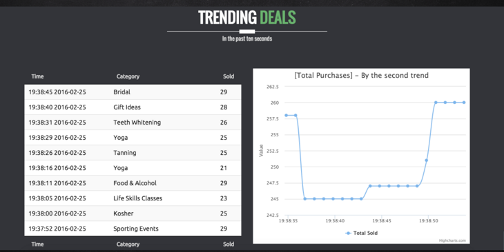
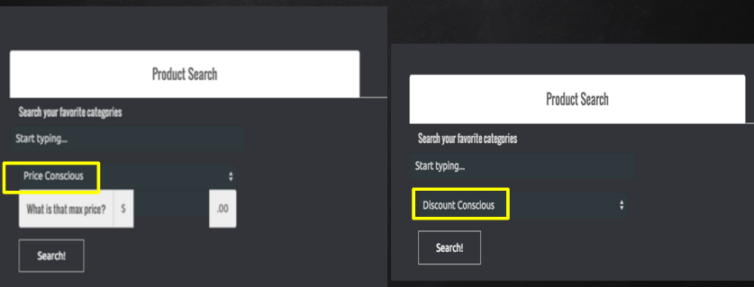
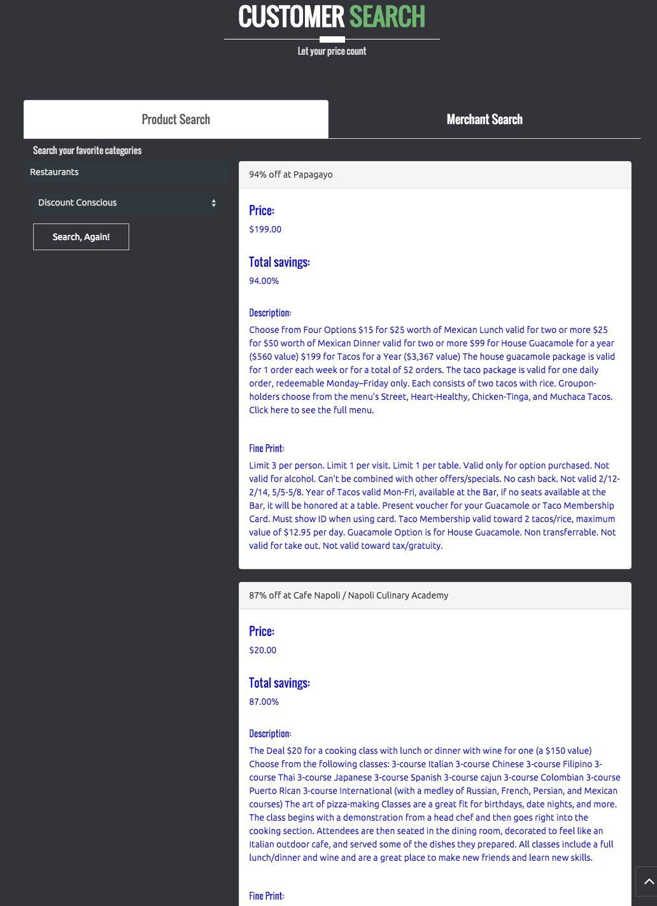
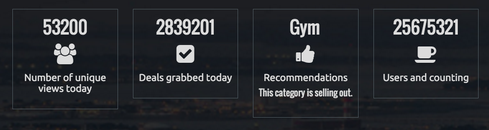
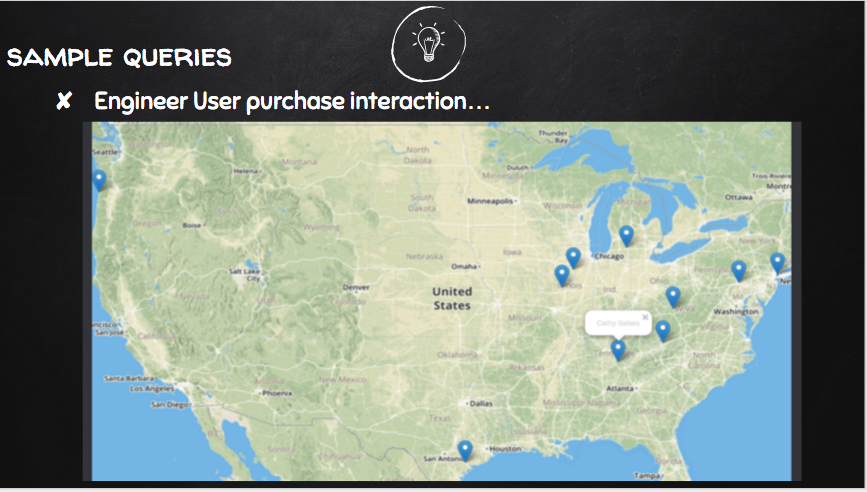
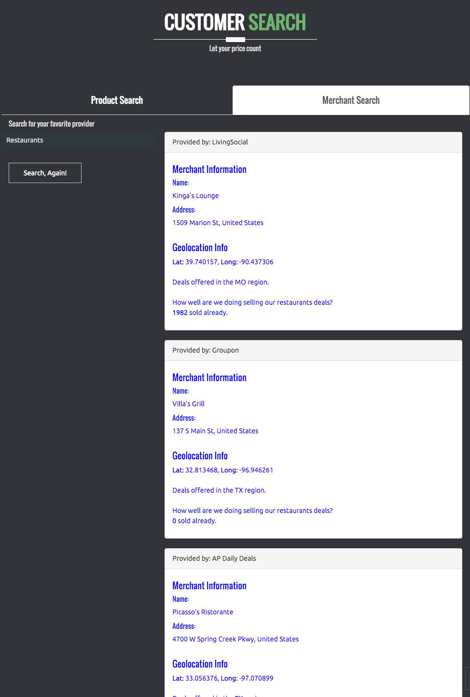
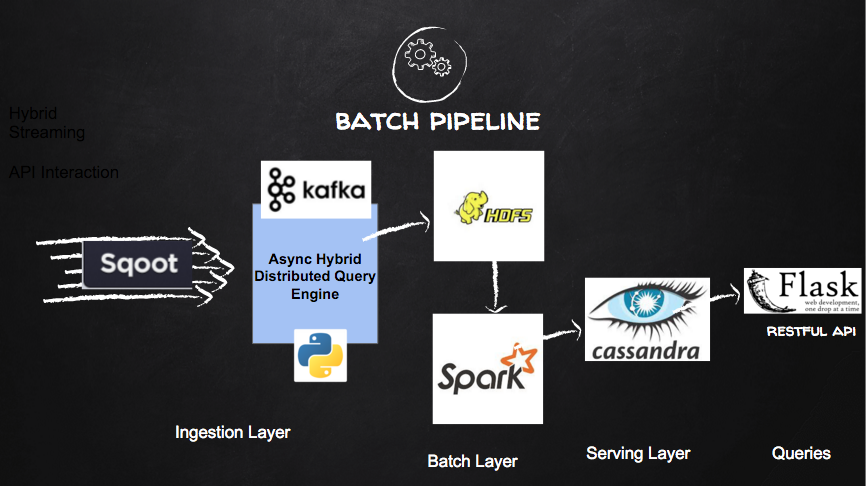

# Introduction to ExStreamly Cheap
============

*This is an actively developed product. Hence documentation is a work in progress*

Table of Contents:

1. [Introduction](README.md#1-introduction)
2. [Motivation](README.md#2-motivation)
3. [Sample Queries](README.md#3-sample-queries)
4. [Engineering Solution](README.md#4-engineering-solution) 
5. [Challenges](README.md#4-challenges)
6. [Take Away](README.md#5-take-aways)
7. [Demo and Slides](README.md#6-demo-and-slides)
8. [Youtube video](README.md#7-direct-youtube-video)

## 1. Introduction
ExStreamly Cheap is a real time scalable deals serving platform. It provides Insights and searching capabilities, maximizing time and profit for end users. 
For three weeks, I worked on www.exstreamlycheap.club using open source tools to create a single platform for inspiration, search, shopping and serving of deals. I leveraged Sqoot's API to gather deals aggregated over different vendors, providers and categories.
A naive recommendation framework is also implemented making it very easy to plug in more robust collaborative filtering or item-item/item-user affinity implementations; to solve more business use cases.

## 2. Motivation
As a techy and gagdet lover, I noticed that I spent a lot of time scouting various sites for the best deals. We all know the importance of savings while getting amazing items at amazing bargains. Searching platforms like Amazon, Groupon and others is a trivial thing. And there are tons of coupons and deals providing sites. However, what makes a deal a deal? Are the prices a real representation of an actual discount when compared to the manufacturers MSRP or is there a third-party mockup? How can a certain deal be addressed and personalized? There isn't a platform that offered a complete, provider agnostic, user-defined preference inspired platform. ExStreamly cheap is my proposed solution to a one-everything platform to solve this problem. From inspiration, search, shopping to recommendations of details based on preferences. My end goal is to develop a notification system on the platform to alert users when deals that match their interest arrive in real time; location based interests, price, discount rate or other interest. This will require plugging in a specialized robust collaborative filtering, affinity inspired recommendation system.

## 3. Sample Queries
Data Source: SQOOT API. Please visit [developer page](http://docs.sqoot.com/v2/overview.html) for an overview of their API.
During the program, the following queries were successfully constructed and executed.
  1. A holistic view of real time trends and purchase visualizations.
  

  2. Deals search based on price and discount options.
  
  This will yield a result like this.
  

  3. Display of recommendations based on engineered user interaction with respect to trends and sales.
  

  4. Users purchasing patterns and interactions: location-based and reviews.
  

  5. Merchant search based on categories
  


## 4. Engineering Solution
The pipeline comprises of both batch and realtime pieces. 

### Batch Process
To boostrap the data pipeline, an asynchronous distributed query engine, (Async DQE) calls the Sqoot API, computes the range of pages to fetch, take into account a time change between the first snapshot and actual data fetch. The fetched data is then marshalled into the pipeline for batch processing.

The Async Distributed Query Engine (ADQE) is a hybrid distributed querying engine, leveraging kafka's thread safeness and messaging queue, that was implemented to mitigate the pagination challenge of the Sqoot API. As ExStreamly Cheap is a service by category platform, a lot of dependency lies on the accuracy of the specified total number of deals at any given time. Sqoot's API was inconsistent, constantly changing total amounts with each millisecond page refresh.The Async DQE is split into three major components.
  1. [First Stage Producer](src/fetch_data/generate_all_categories.py) that utilizes [Sqoot Data Fetcher](src/fetch/fetch_sqoot_data.py) to interact with the API. Multiple producers - one for each category -  are spun in parallel on tmux sessions as the main interaction with the data source. As each category total is computed, the producers into the first kafka topic       
```all_deals_ url - a message with timestamp, url for consumer to fetch and page chunks to grab. ```
This follows the leaky bucket approach. 
  2. Intermediate Hybrid Consumer-Producer that creates multiple consumers (2:1 producer) to enable a unique fetch of actual data. A consumer-producer becomes available, fetches from the first stage topic. For that instance of producer, multiple OS threads are spun to grab each individual page as fast as possible. At this point, order of deals isn't important. Aggregation will be handled in spark. The final order synchronization when writing out to file (or another subsequent kafka topic) is handled by a BoundedSemaphore. Output is then written to the final ```deals_data``` topic.
  3. Final Stage Consumer that fetches from the final kafka topic and persists the data to HDFS.


## 5. Challenges
## 6. Take Aways
## 7. Demo and slides
A well detailed presentation can be found at link below. Please note that it includes the video as well.
https://www.slideshare.net/EmmanuelAwa/exstreamlycheap-final-slides

## 8. Direct Youtube video
Please find the demo video alone below.
https://www.youtube.com/playlist?list=PL8YCTmxcfHXUxGOlzwaYuTWfxhVqLyWkW
